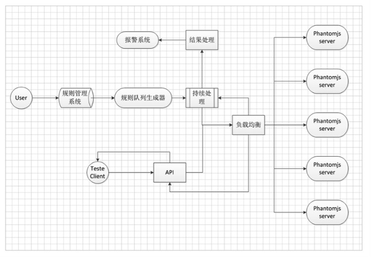

# PhantomJS 和NodeJS在网站前端监控平台的最佳实践


> 本文为8月31日，『前端之巅』群在线分享活动总结整理而成

## 1. 为什么需要一个前端监控系统

通常在一个大型的 Web 项目中有很多监控系统，比如后端的服务 API 监控，接口存活、调用、延迟等监控，这些一般都用来监控后台接口数据层面的信息。而且对于大型网站系统来说，从后端服务到前台展示会有很多层：内网 VIP、CDN 等。

但是这些监控并不能准确地反应用户看到的前端页面状态，比如：页面第三方系统数据调用失败，模块加载异常，数据不正确，空白开天窗等。

这时候就需要从前端 DOM 展示的角度去分析和收集用户真正看到的东西，从而检测出页面是否出现异常问题。

## 2. 需要监控系统解决的问题

页面通常出现以下问题时需要及时邮件、短信上报通知相关人员修复问题。

* 返回错误（50x, 40x）无法打开
* 模块加载失败
* 页面乱码
* 数据正确性
* 现场快照，复现问题

## 3. 技术选型

监控的意义和测试的意义在本质上是一致的，都是对已上线功能进行回归测试，但不同的是监控需要做长期的可持续可循环的回归测试，而测试仅仅需要在上线之后做一次回归测试。

既然监控和测试的本质一致，那我们是完全可以采用测试的方式来做监控系统的。在自动化测试技术遍地开花的时代，不乏很多好用的自动化工具，我们仅仅需要把这些自动化工具进行整合为我们所用即可。

* NodeJS - 特别适用于网络密集型任务
* PhantomJS - 模拟无界面的浏览器，提供丰富的内核交互 API

**NodeJS**

NodeJS 是一个 JavaScript 运行环境，并且 NodeJS 支持非组塞 I/O 和异步、事件驱动，这点对于我们构建基于 DOM 元素的监控是比较重要的。

**PhantomJS**

PhantomJS 是一个基于 webkit 的 JavaScript API。它使用 QtWebKit 作为它的核心浏览器，使用 webkit 来编译解释执行 JavaScript 代码。任何你可以在基于 webkit 浏览器做的事情，它都能做到。

它不仅是个隐形的浏览器，提供了诸如 CSS 选择器、支持Web标准、DOM操作、JSON、HTML5、Canvas、SVG 等，同时也提供了处理文件 I/O 的操作，从而使你可以向操作系统读写文件等。PhantomJS 的用处可谓非常广泛，诸如网络监测、网页截屏、无需浏览器的 Web 测试、页面访问自动化等。

**为什么不是 Selenium**

做自动化测试的同学肯定都知道 Selenium。可以使用 Selenium 将测试用例在浏览器中执行，而且 Selenium 对各种平台和常见浏览器支持比较好，但是 Selenium 上手难度系数略高，而且使用Selenium 需要在服务器端安装浏览器。

考虑到监控主要任务在监控不在测试。系统并不需要太多考虑兼容性，而且监控功能相对单一，主要对页面进行功能上的回归测试，所以选择了 PhantomJS。

## 4. 架构设计

### 架构概览

架构如下图所示



### 架构简述

对于 DOM 监控服务，在应用层面上进行了垂直划分：

* 规则管理系统。
* 规则队列生成器。
* 长时持续处理器。
* PhantomJS 服务。
* 服务化 API。

在应用层面上进行的垂直划分可以对应用做分布式部署，提高处理能力。后期再性能优化、系统改造扩展等方面也能提高简易性。

## 5. 解决方案

### （1）前台规则录入

这是一个独立的 Web 系统，系统主要用来收集用户录入的页面信息、页面对应的规则、展示错误信息。通过调用后端页面抓取服务来完成页面检测的任务，通过系统可以创建三种类型的检测页面：常规监控、高级监控、可用性监控。

**常规监控**

录入一个页面地址，和若干检测规则。注意这里的检测规则，我们把常用的一些检测点抽象成了一条类似测试用例的语句。每条规则用来匹配页面上的一个 DOM 元素，用 DOM 元素的属性来和预期做匹配，如果匹配失败系统就会产生一条错误信息，后续交由报警系统处理

匹配类型一般有这几种：长度、文本、HTML、属性
处理器 类似编程语言中的操作符：大于、大于等于、小于、小于等于、等于、正则。

这样做的好处就是，录入规则的人只要了解一点 DOM 选择器的知识就可以上手操作了，在我们内部通常是交由测试工程师统一完成规则的录入。

**高级监控**

主要用来提供高级页面测试的功能，一般由有经验的工程师来撰写测试用例。这个测试用例写起来会有一些学习成本，但是可以模拟 Web 页面操作，如：点击、鼠标移动等事件。从而做到精确捕捉页面信息。

**可用性监控**

可用性监控侧重于对页面的可访问性、内容正确性等比 严重的问题 的即时监控。通常这类页面我们只需要在程序里面启一个 Worker 不断的去获取页面 HTML 就可以对结果进行检测匹配了，所以我们选择了 NodeJS 来做异步的页面抓取队列，高效快速的完成这种网络密集型任务。

### （2）主动错误上报

**页面脚本执行错误监控**

页面引入一段监控脚本来收集页面产成 error 事件的信息，自动上报给后端服务，在系统里面可以汇总所有报错信息，以及对应的客户端浏览器版本、操作系统、IP 地址等。

**页面主动上报**

这个功能需要对应的前端工程师在代码中调用错误上报 API，来主动提交错误信息。主要使用的场景有，页面异步服务延时无响应、模块降级兜底主动通知等。监控脚本提供几个简单的 API 来完成这项任务。

```
// error 方法调用后立即上报错误信息并发出邮件、短信通知
errorTracker.error('错误描述')
// info 方法调用后立即上报信息，并在单位时间内仅仅产生一条邮件、短信通知
errorTracker.info('信息描述')
// log 方法调用后由报错检测是否达到设置阀值，最终确认是否报错
errorTracker.log('日志信息')
```

### （3）后端页面抓取服务

由于京东很多页面内容是异步加载的，像首页、单品等系统有许多第三方异步接口调用，使用后端程序抓取到的页面数据是同步的，并不能取到动态的 JavaScript 渲染的数据，所以就必须使用像 PhantomJS 这种能模拟浏览器的工具。

常规监控我们使用 PhantomJS 模拟浏览器打开页面进行抓取，然后将监控规则解析成 JavaScript 代码片段执行收集结果。

高级监控我们使用 PhantomJS 打开页面后向页面注入像 jasmine, Mocha 等类似的前端 JavaScript 测试框架，然后在页面执行对应的录入测试用例并返回结果。

**规则队列生成器**

规则队列生成器会将规则系统采集的规则转化类成消息队列，然后交由长时持续处理器依次处理。

**为什么采用类消息队列的处理方式？**

这和 PhantomJS 的性能是密不可分的，由多次实践发现，PhantomJS 并不能很好地进行并发处理，当并发过多，会导致 CPU 过载，从而导致机器宕机
在本机环境下的虚拟机中进行并发测试，数据并不理想，极限基本在 ab -n 100 -c 50 左右。 所以为了防止并发导致的问题，就选择了使用类消息队列来避免因为并发过高导致的服务不可用。

**类消息队列的实现**

我们这里通过调用内部的分布式缓存系统生成类消息队列，队列的生成其实可以参考数据接口–队列。最基本的模型就是在缓存中创建一个 KEY ，然后根据队列数据结构的模式进行数据的插入和提取。

当然，类消息队列的中间介质可根据你实际的条件来选择，当然你也可以使用本机内存实现。这可能会导致应用和类消息队列竞争内存。

**长时持续处理器**

长时持续处理器是要功能就是消费规则队列生成器生成的类消息队列。

**长时持续处理实现**

在长时持续处理器的具体实现中，我们充分利用了 JavaScript 的 setInterval 方法来持续获取累消息队列的内容下发给规则转化器，然后转发给负载均衡调度器。之后再对返回的结果进行统一处理，比如邮件或者短信报警。

**API**

PhantomJS 服务可以做为公共 API 提供给客户端进行测试需求的处理， API 通过 HTTP 方式调用。在 API 的处理上需要提供 HTTP 数据到规则和 PhantomJS 的转换。从而又演化出了 HTTP 数据到规则转换器。

**PhantomJS 服务**

PhantomJS 服务是指将 PhantomJS 结合 HTTP 服务和子进程进行服务化的处理

首先、启动 HTTP 服务，然后将长时处理器下发的规则进行进一步转化，转化后启动子进程，HTTP 服务会监听子进程的处理结果，并在处理完毕之后返回。

### (4)报警系统

报警系统我们目前使用的是京东内部自的统一监控平台 UMP，通过调用平台提供的一些 API 来实现报警邮件与短信通知。

**如何根据报警到具体页面？**
在用户通过监控管理系统录入规则后，监控系统会根据 UMP 规则针对用户录入的页面生成 UMP 使用的 key。当长时持续处理器发现 PhantomJS 服务返回的结果标示为异常后，就会使用 key 来进行日志记录。

**何时出发报警？**
报警主要分为了短信和邮件报警。邮件报警是在每条异常之后就会发给指定系统用户。短信则是根据异常次数来进行处理的，当异常次数过大，就会下发短信通知。

### (5)部署

对于此系统部署是分为两大块进行的。因为机器资源数量有限，没有将所有部分都单独部署。

规则管理系统以及规则队列生成器和持续处理器整合部署在一台机器上，PhantomJS服务部署在了其他的机器上。进程管理使用了著名的PM2。这样就可以避免自己在开发类似的部署功能。PM2 是一个带有负载均衡功能的NodeJS应用的进程管理器。可充分利用CPU，并保证进程永远都存活。

PM2 特性：

* 内建负载均衡（使用 Node cluster 集群模块）。
* 无缝重启类似 nginx reload。
* 具有 Ubuntu 和 CentOS 的开机启动脚本。
* 控制台检测。
* 不过在此次部署中，并没有使用内建负载均衡的特性，没用通过集群的方式部署代理。仅仅使用了后台运行和 0 秒停机重载的特性

## 6. 总结与展望

其实我们现在开发的这套监控系统并不复杂，只是合理的运用了一些现有的技术框架。抽象出来我们自己需要的一些功能。但却有效的达到了我们的预期功能，并且节省了很多之前需要人肉测试的时间成本。系统本身还有很多问题在待解决状态，比如报警系统的规则处理与阀值设定，JavaScript报错的准确过滤机制等，这些问题我们都会一一解决，并且未来的前端监控系统会成为一个平台，核心服务在后端爬取页面服务，应用端可以有多种形式，比如监控、测试工具等。

一些可以持续优化点：

* 监控系统虽然在应用层面进行了垂直划分，但是由于机器资源等限制，并没有进行单独功能的部署。这点可能会在后期的使用中进行优化。因为现在仅仅提供给本部门使用。
* PhantomJS服务还需要进一步优化，以承载大并发，大处理量。提供成稳定的服务。协同开发业务线和测试业务线制定统一的规范，以达到优化的监控。
* 报警由于依赖于公司内部的UMP系统，所以并不是特别灵活，每次系统接入都需要用户去UMP系统接入。


> 作者 周琪力 王备 发布于 2016年11月17日 来源: [http://www.infoq.com/cn/articles/practise-of-phantomjs-and-nodejs-in-jingdong](http://www.infoq.com/cn/articles/practise-of-phantomjs-and-nodejs-in-jingdong)

