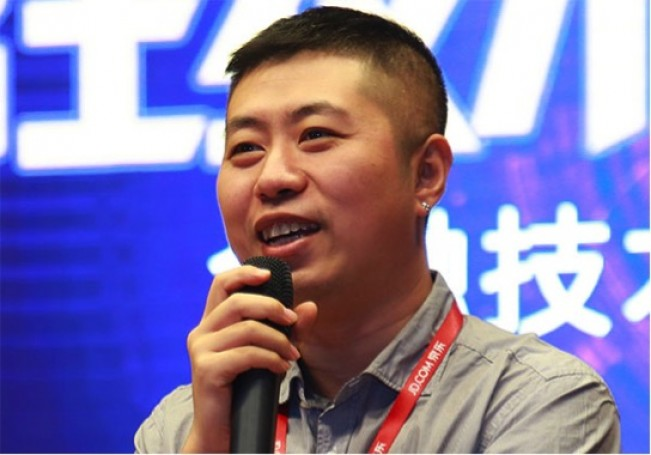

# 走进京东金融：听过来人谈经验及技术干货

> 本文涉及到京东金融技术的发展历程和挑战、技术负责人的管理理念、还有风控、人脸识别、资产负债、白条、支付等，干货满满。现在乃至未来，京东金融要做的是：遵从金融本质，以数据为基础，以技术为手段，为金融行业服务，从而帮助金融行业提升效率、降低成本、增加收入。

以「金融科技」定位的京东金融集团成立于2013年10月，逐步构建了供应链金融、消费金融、财富管理、众筹、证券、保险、支付、金融科技以及农村金融九大业务板块。

京东金融CEO陈生强表示，京东金融以数据为基础，以技术为手段，借力京东的场景和用户资源来做金融业务，这是自营金融业务。现在乃至未来，京东金融要做的是：遵从金融本质，以数据为基础，以技术为手段，为金融行业服务，从而帮助金融行业提升效率、降低成本、增加收入。这个定位就是金融科技。

京东金融这三年多，从无到有，从有到精，一路走来，背后定有许多精彩故事。本着学习的态度，有幸和京东金融部分技术人进行面对面的交流，过程中涉及到京东金融技术的发展历程和挑战、技术负责人的管理理念、风控、人脸识别、资产负债、白条、支付等，干货满满。我将通过本文，带大家一起走进京东金融，一瞥金融科技公司的幕后战场。

## 京东金融技术的发展历程&挑战

京东金融技术体系根源于京东商城技术沉淀，人员由外部引进和京东商城各体系（网站、订单交易、支付、财务、数据等）研发团队的技术精英组成。京东金融技术架构起始就有一定前瞻性，主要因素是这些研发团队和京东商城一起快速成长，且多次经历过像618和双11等各种技术大考。基于这些使得支付、白条、风控等大流量业务能够平稳安全度过，访问量呈现几百上千倍增长的挑战，避免了业务高速发展中一些高昂的试错成本。

当然，金融业务和商城业务有很大区别，整个金融业务可以看成是一种“虚拟经济”，对数字理解、技术领先性有特殊的要求。京东金融这三年的技术成长过程中面临种种挑战，这里主要讲述四方面：**流量**、**一致性**、**大数据**和**科技**：

流量：流量是所有中大型互联网公司都会面临的问题，解决方案相对较成熟，如分库分表、动静分离、冷热分离、（多级）缓存等。这些解决方案基本存在共同特征，那就是后台计算逻辑并不复杂，系统运算时间在整个周期中几乎可忽略不计。但京东金融某些业务并不是这样，以风控为例，一笔订单支付，用户感受到的是瞬间（一秒以内）就完成支付过程，但这短短一秒内风控系统要做很多事，如判断用户的设备信息、登录行为、访问特征、信用状况、商品信息、商家特征、配送区域、银行卡状态等。如建立信用、反欺诈、伪冒交易等一系列模型，其中多达近百项的模型需实时计算。这样庞大的运算量在一秒内，甚至几十毫秒内完成，不是易事。况且在618和双11等大促中，为了用户的账户和资金安全，不能轻易去降级，这本身就是一个巨大的挑战。

一致性：金融业务特征决定数据一致性差异的容忍度很低。以白条业务为例，角色有消费者、商户、小贷公司、京东商城、第三方支付、银行等，角色之间会有费用往来，如账务出现细微差异就会导致工作阻塞。系统是分模块设计的，看似打了个简单白条，却要经过交易、计息、分期、账务、资金、资管（ABS）等一系列模块，为兼顾性能，架构设计时对轻事务模型方案做了一定的妥协，这样也是为扩大前端收单能力。这样一来，如何让数据在多个模块中保持一致性就成了挑战。所以当数据快速进来，后端要有精密的核验机制来协调数据的一致性。

大数据：对大数据的理解各有不同，以点带面，京东金融是从数据服务于应用的角度来考虑他的挑战性。以白条授信为例，白条是国内第一家无纸化授信的互联网消费金融产品，那么用户授信、授信额度是首要面临的问题。白条初期，大家一起商讨如何搭建授信模型,业务说条件，技术做翻译，通过数据集市筛选出来合格的用户，额度也是人为定的简单规则，这导致白条上线初期，仅有特邀用户才能开通白条。随着业务发展，市场表现超出预期，逼迫技术必须革新。京东金融不断研究新技术解决方案的同时还引进更多更专业型的技术人才（模型、算法、分析以及大数据开发等）。目前，整个授信过程实现全自动，人的经验明显落后于海量维度精细化测算的评分结果。分析人员也在不断训练和调校模型的准确性，进行系统快速迭代。评分模型已覆盖全部京东用户，大半活跃用户均在授信范围。

科技：这是京东金融一直在探索创新的领域，如人脸识别、语音识别、区块链等。人脸识别在各大金融场景较常见，但各个产品的体验也不尽相同，考虑到人脸特征背后需要精细数据支撑，出于对数据安全的考虑，技术在市场上并没有公共的服务，一些实力公司投入重金进行自研。人脸识别最大的挑战是准确性，实验室环境简单，数据样本较少，真实的环境中人物有表情、年龄、背景、角度甚至是伪造视频等不同因素的挑战，会让整体准确性大打折扣。准确性没有达到市场要求时却推广，对用户来说是一种负体验。在金融行业，有这样需求的产品越来越多，实名、开户、安全交易甚至登陆等都是非常不错的应用场景。市场是技术成长最大的推动力，摆在京东金融面前的压力是如何让自研技术能够赶上和超越市场上人脸识别的准确度。

### 京东金融技术体系负责人曹鹏谈管理

曹鹏·京东集团副总裁、京东金融技术体系负责人

曹鹏，现任京东集团副总裁、京东金融技术体系负责人。毕业于北京交通大学，取得人民大学EMBA，目前在读清华五道口EMBA；历任京东商城研发总监、产品总监、职能研发副总裁，现任京东金融副总裁。

很荣幸成为第一个给曹鹏做专访的媒体人，他02年认识刘强东，07年受邀加入京东，13年请缨来到京东金融。

京东金融是京东内部孵化的公司，在最初期紧贴业务、快速响应，很好的活下来才是技术首要。随着业务的爆棚，作为技术负责人，只埋头做技术是远远不够的，而是要清楚「公司目标是什么？从众多业务中做出抉择，哪些做哪些不做？」。同时在思考，不能把精力四处散落，什么都想干，要集中技术力量始终保持和业务的步调相契合，把产品、研发、运维、测试等技术和业务绑在一起，打造业务上的闭环，业务发展才会更茂盛。

技术人做管理，最重要的是思考方式的转换。对于技术人来说，一方面是很难量化考核，另一方面业务技术互驱动，如业务很牛，说明技术很到位；业务发展好，快速扩张，技术人就会有上升的空间。所以与其制定条条框框，方方面面都管，不如「将心比心 以身作则」提升、激发技术人员的主观能动性。同时曹鹏表示，读EMBA也是为了从创业公司老板身上，看到老板和自己思维模式上的差异。最初在京东做管理主要是接需求、做任务，在原有架构上做大大小小的调整，一个个攻坚开发新系统。现在更多的是站在老板的角度看问题，将技术目标与公司目标统一，通过技术的突破发展为公司的发展做出更大的贡献。

京东的下一个12年战略规划是全面走向技术化，京东金融技术体系目前也在不断吸纳更多优秀的人才加入，提升金融科技实力，进行技术输出。最理想的状态是团队三分之一的人完成业务的支撑，其他人利用京东集团自身和外部的大数据资源、用户和流量等优势，结合当下人工智能、人脸识别、深度学习等最新技术，研发创新产品，一方面运用到适合的场景中，步步迭代，力争把用户体验做到最极致；一方面为金融行业提供一流的技术输出服务。

### 京东金融风控研发部架构师王美青谈风控

*作者：王雪燕 来源：51CTO|2017-02-15 19:04 来源: [http://www.51cto.com/art/201702/531343.htm](http://www.51cto.com/art/201702/531343.htm)*

