# 走进京东金融：听过来人谈经验及技术干货

> 本文涉及到京东金融技术的发展历程和挑战、技术负责人的管理理念、还有风控、人脸识别、资产负债、白条、支付等，干货满满。现在乃至未来，京东金融要做的是：遵从金融本质，以数据为基础，以技术为手段，为金融行业服务，从而帮助金融行业提升效率、降低成本、增加收入。

以「金融科技」定位的京东金融集团成立于2013年10月，逐步构建了供应链金融、消费金融、财富管理、众筹、证券、保险、支付、金融科技以及农村金融九大业务板块。

京东金融CEO陈生强表示，京东金融以数据为基础，以技术为手段，借力京东的场景和用户资源来做金融业务，这是自营金融业务。现在乃至未来，京东金融要做的是：遵从金融本质，以数据为基础，以技术为手段，为金融行业服务，从而帮助金融行业提升效率、降低成本、增加收入。这个定位就是金融科技。

京东金融这三年多，从无到有，从有到精，一路走来，背后定有许多精彩故事。本着学习的态度，有幸和京东金融部分技术人进行面对面的交流，过程中涉及到京东金融技术的发展历程和挑战、技术负责人的管理理念、风控、人脸识别、资产负债、白条、支付等，干货满满。我将通过本文，带大家一起走进京东金融，一瞥金融科技公司的幕后战场。

## 京东金融技术的发展历程&挑战

京东金融技术体系根源于京东商城技术沉淀，人员由外部引进和京东商城各体系（网站、订单交易、支付、财务、数据等）研发团队的技术精英组成。京东金融技术架构起始就有一定前瞻性，主要因素是这些研发团队和京东商城一起快速成长，且多次经历过像618和双11等各种技术大考。基于这些使得支付、白条、风控等大流量业务能够平稳安全度过，访问量呈现几百上千倍增长的挑战，避免了业务高速发展中一些高昂的试错成本。

当然，金融业务和商城业务有很大区别，整个金融业务可以看成是一种“虚拟经济”，对数字理解、技术领先性有特殊的要求。京东金融这三年的技术成长过程中面临种种挑战，这里主要讲述四方面：**流量**、**一致性**、**大数据**和**科技**：

流量：流量是所有中大型互联网公司都会面临的问题，解决方案相对较成熟，如分库分表、动静分离、冷热分离、（多级）缓存等。这些解决方案基本存在共同特征，那就是后台计算逻辑并不复杂，系统运算时间在整个周期中几乎可忽略不计。但京东金融某些业务并不是这样，以风控为例，一笔订单支付，用户感受到的是瞬间（一秒以内）就完成支付过程，但这短短一秒内风控系统要做很多事，如判断用户的设备信息、登录行为、访问特征、信用状况、商品信息、商家特征、配送区域、银行卡状态等。如建立信用、反欺诈、伪冒交易等一系列模型，其中多达近百项的模型需实时计算。这样庞大的运算量在一秒内，甚至几十毫秒内完成，不是易事。况且在618和双11等大促中，为了用户的账户和资金安全，不能轻易去降级，这本身就是一个巨大的挑战。

一致性：金融业务特征决定数据一致性差异的容忍度很低。以白条业务为例，角色有消费者、商户、小贷公司、京东商城、第三方支付、银行等，角色之间会有费用往来，如账务出现细微差异就会导致工作阻塞。系统是分模块设计的，看似打了个简单白条，却要经过交易、计息、分期、账务、资金、资管（ABS）等一系列模块，为兼顾性能，架构设计时对轻事务模型方案做了一定的妥协，这样也是为扩大前端收单能力。这样一来，如何让数据在多个模块中保持一致性就成了挑战。所以当数据快速进来，后端要有精密的核验机制来协调数据的一致性。

大数据：对大数据的理解各有不同，以点带面，京东金融是从数据服务于应用的角度来考虑他的挑战性。以白条授信为例，白条是国内第一家无纸化授信的互联网消费金融产品，那么用户授信、授信额度是首要面临的问题。白条初期，大家一起商讨如何搭建授信模型,业务说条件，技术做翻译，通过数据集市筛选出来合格的用户，额度也是人为定的简单规则，这导致白条上线初期，仅有特邀用户才能开通白条。随着业务发展，市场表现超出预期，逼迫技术必须革新。京东金融不断研究新技术解决方案的同时还引进更多更专业型的技术人才（模型、算法、分析以及大数据开发等）。目前，整个授信过程实现全自动，人的经验明显落后于海量维度精细化测算的评分结果。分析人员也在不断训练和调校模型的准确性，进行系统快速迭代。评分模型已覆盖全部京东用户，大半活跃用户均在授信范围。

科技：这是京东金融一直在探索创新的领域，如人脸识别、语音识别、区块链等。人脸识别在各大金融场景较常见，但各个产品的体验也不尽相同，考虑到人脸特征背后需要精细数据支撑，出于对数据安全的考虑，技术在市场上并没有公共的服务，一些实力公司投入重金进行自研。人脸识别最大的挑战是准确性，实验室环境简单，数据样本较少，真实的环境中人物有表情、年龄、背景、角度甚至是伪造视频等不同因素的挑战，会让整体准确性大打折扣。准确性没有达到市场要求时却推广，对用户来说是一种负体验。在金融行业，有这样需求的产品越来越多，实名、开户、安全交易甚至登陆等都是非常不错的应用场景。市场是技术成长最大的推动力，摆在京东金融面前的压力是如何让自研技术能够赶上和超越市场上人脸识别的准确度。

### 京东金融技术体系负责人曹鹏谈管理

曹鹏·京东集团副总裁、京东金融技术体系负责人

曹鹏，现任京东集团副总裁、京东金融技术体系负责人。毕业于北京交通大学，取得人民大学EMBA，目前在读清华五道口EMBA；历任京东商城研发总监、产品总监、职能研发副总裁，现任京东金融副总裁。

很荣幸成为第一个给曹鹏做专访的媒体人，他02年认识刘强东，07年受邀加入京东，13年请缨来到京东金融。

京东金融是京东内部孵化的公司，在最初期紧贴业务、快速响应，很好的活下来才是技术首要。随着业务的爆棚，作为技术负责人，只埋头做技术是远远不够的，而是要清楚「**公司目标是什么？从众多业务中做出抉择，哪些做哪些不做？**」。同时在思考，不能把精力四处散落，什么都想干，要集中技术力量始终保持和业务的步调相契合，把产品、研发、运维、测试等技术和业务绑在一起，打造业务上的闭环，业务发展才会更茂盛。

技术人做管理，最重要的是思考方式的转换。对于技术人来说，一方面是很难量化考核，另一方面业务技术互驱动，如业务很牛，说明技术很到位；业务发展好，快速扩张，技术人就会有上升的空间。所以与其制定条条框框，方方面面都管，不如「将心比心 以身作则」提升、激发技术人员的主观能动性。同时曹鹏表示，读EMBA也是为了从创业公司老板身上，看到老板和自己思维模式上的差异。最初在京东做管理主要是接需求、做任务，在原有架构上做大大小小的调整，一个个攻坚开发新系统。现在更多的是站在老板的角度看问题，将技术目标与公司目标统一，通过技术的突破发展为公司的发展做出更大的贡献。

京东的下一个12年战略规划是**全面走向技术化**，京东金融技术体系目前也在不断吸纳更多优秀的人才加入，提升金融科技实力，进行技术输出。最理想的状态是团队三分之一的人完成业务的支撑，其他人利用京东集团自身和外部的大数据资源、用户和流量等优势，结合当下人工智能、人脸识别、深度学习等最新技术，研发创新产品，一方面运用到适合的场景中，步步迭代，力争把用户体验做到最极致；一方面为金融行业提供一流的技术输出服务。

### 京东金融风控研发部架构师王美青谈风控

王美青·京东金融风控研发部架构师

**风控的灵魂是数据，所有决策都以数据为驱动**。策略和模型是风控做出决策的两大依据，策略偏向有效性、模型偏向预测和度量，两者有非常多的联系和结合，根据业务和场景来选择合适的方案，并且需要人工与自动化结合来调整。两者都离不开基于大数据的挖掘能力，都需要做特征工程，只有把挖掘的成果再次加工和抽象，做成最原子的规则，才能形成复杂的策略。

京东金融，有数百个需要风险控制的场景，交易类占比最大，非交易类有促销优惠、白条激活、信用评估等，这么多业务都需要风控做出实时决策。同时保证执行最复杂的策略与模型时，在性能上做到毫秒级（几十毫秒）。实时和准实时决策引擎，所用到的所有输入数据还必须做预计算。

当事件发生时，与之关联的计算项会有几千甚至上万项，从storm迁移到自主研发实时计算平台，通过简单配置即可完成支持时间滑动窗口的计算，满足指标与变量多样化复杂化计算并且不需要单独发布，在这一点上要优于storm，在性能上，同样基于akka，丝毫不逊于storm。另外一部分计算当然就是通过跑批完成，开始在使用MapReduce，热数据全部内存化（redis），之后使用kylin与flink相结合的方式，根据计算项的数据来源和窗口规格来确定使用哪种计算方式。这些计算结果会被引擎直接使用，所以决策引擎被内部定义为一个轻量级的策略与模型的计算框架，背后由数个系统组成。

**和传统风控相比，互联网+金融是数据风控最大的优势**。从维度方面来说，数据风控会涉及到社交领域、画像等互联网因素，所以数据风控更关注的是互联网社会行为数据。

开始以业务系统产生的数据和点击流作为主要挖掘的素材来源，这部分和用户的行为关系最大，也可以非常有效的识别风险，但随时间推移，恶意用户的知识是在积累的，他们的反侦察能力在不断提升，可以去模拟正常的用户。这时，就要渗入到用户所在的环境里，把打造设备指纹、生物探针等分别应用于Web和移动设备上，作为移动安全的一部分。这为分析恶意用户提供非常有效的一个途径，用户长时间积累的数据会形成一个稳定的习惯模型，发现异常及时通知。行为可以模拟但习惯被模拟的代价就非常高。

针对数据的治理，京东金融目前用机器学习建设了很多的模型，如下图。
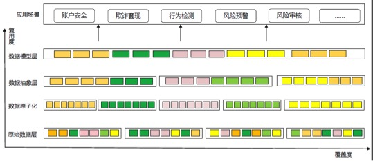

最下层的是各种数据进入大数据环境后，由于原始数据存在杂乱无章的现象，此处使用各种颜色来示意。数据原子化是经过整理后，把数据按业务归属分类，形成最原子的类别，比如账户，资金，投资，消费等等。数据抽象层是按风控关注的业务做数据整合，这层是最贴近业务的。每一块代表一类业务，一个原子数据类是可以被放入多个抽象数据块里的。数据模型层主要是对分析场景使用的，基本就是一个数据模型块对应一个分析场景。

机器学习在京东金融的**天盾风控系统**应用流程如下：

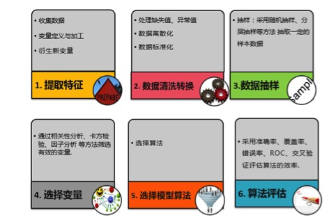

根据经验，在算法的选择上尽可能的多做选择，对比模型的性能择优选取。另外，对样本库做好治理工作，可使用随机抽样和使用聚类把样本数据分层抽取。这些工作是建模人员在大数据环境中也就是离线做的，那么，怎么把训练的模型应用到线上做实时呢，下图是架构：

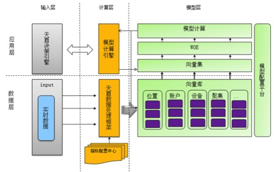

京东金融目前正在开发**机器学习平台**，让懂机器学习的人就可以使用机器学习做想的事情，当前懂机器学习的人不在少数，但真正使用机器学习做具体事情不多，故此平台不但满足内部建模训练、发布等，还可对外输出。
数据风控还有很长的路要走，如量化投资风险评估与运营也属风控范畴，风控也可和推荐领域相结合。如数据会有阶段性差异，质量会随时间推移，慢慢发生变化，可能花费很大精力产出的预测产品会失效，调整代价难易不可估。如不同场景准确度和覆盖度都是不同的，尺度如何把握。如怎样能降低统计分析学和分布式计算相结合的成本等等。
总之，互联网金融风控核心还是服务客户，提升产品价值，最大程度的做到差异化的防范，智能化是风控的发展方向，京东金融从开始就致力于**打造智能化的风险管控解决方案**。

### 京东金融支付核心研发部负责人安培谈支付

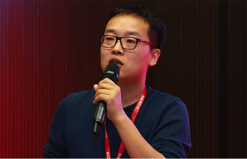
安培·京东金融支付核心研发部负责人

安培表示，很幸运加入京东金融，伴随着京东金融一起飞速成长。京东金融支付系统支撑着整个集团业务线上、线下的收款，不仅要支持业务海量的需求，又要抗得住每年翻番增长的流量，对技术架构和项目管理是一个很大的挑战！

京东每年流量的增长都远远超出预期，经过几年的迭代和数次架构升级，支付系统从一个小小的收银台，逐渐演化成了几十个系统、上千台集群服务器构成的复杂应用。支付系统作为京东集团重要的业务支撑系统有很多自己的特点：

**高并发**：支付系统支撑着整个京东集团线上、线下的收款，每年流量翻番增长，对系统架构是一个很大的挑战！就在16年的双11凌晨，系统非常稳定的承受了京东历史上最大的流量洪峰。

**安全、数据强一致性**：支付系统存储着大量用户银行卡、支付密码等重要且敏感信息。因此防XSS、防sql注入就成了重中之重，安全工程师则每天都要对系统进行漏洞测试，渗透性测试等。因为涉及用户真实的资金，支付系统对于数据一致性和安全的强要求是毋庸置疑的。是的，一条数据都不能错，一条数据都不能丢！

**调用链路长**：支付系统既要符合业内安全规范，又涉及商户、机构、银行间的网络交互，以至于网络环境非常复杂，一个用户的支付请求需要穿越多个机房，数个防火墙，几次从公网到内网，从内网到公网的转化！而且，支付系统背后的渠道是上百家技术能力参差不齐的银行，就导致不仅调用链路长，而且延迟性非常高。从用户体验和系统并发的角度，在两年前对系统做了全流程请求异步化改造。

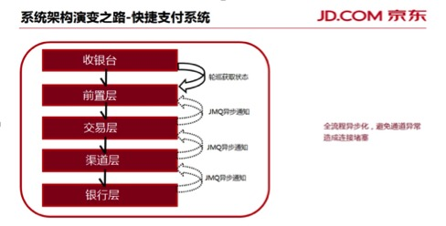

**实时性**：试想一个场景，用户在线支付了一个彩票订单并付款成功，但是由于支付系统的延时，导致没能及时通知彩票系统出单。期间彩票开奖，用户投注的号码中得头奖，但因出单失败，500万大奖不翼而飞！可见支付系统的实时性是多么必要。京东很多业务流程的状态都依靠支付成功的消息去推动，比如实物订单要在支付成功后才能推送到库房生产，手机充值订单需要支付成功后才能给用户充值。一个大数据的分析系统，报表的数据可以离线计算，而对于支付系统而言所有请求必须实时处理，刻不容缓！

**依赖系统众多**：支付系统依赖数十个左右的核心服务，上百家合作银行。要保证一旦依赖的服务出问题，对支付系统的影响是最低，小伙伴经常需要凌晨登录VPN对依赖的服务降级，对故障的通道进行切换。并且支付有很多琐碎的运营工作，如各种维度的成功率、转化率监控，银行的限额变更，错误码变更等。这时一个强大、多功能灵活的运营后台应运而生！

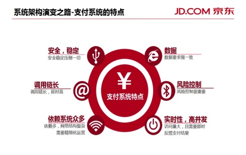

基于以上的特性，要求系统必须是High Availability(高可用)！然而真正 High Availability的系统不单单只是能应对大流量。

常见的分库分表的系统架构，存在两个重要不足：
* 对数据库强依赖，当数据库宕机的时候，整个应用是无法对外提供服务的。在真实的运维场景，服务器的内存条坏了、硬盘烧了、交换机故障等是家常便饭，这些故障需要值班运维介入处理，最快也要五分钟时间。五分钟对于集团的支付系统而言，可能是千万资金的收款，这种事故无法面对。
* 扩容，以MySQL为例，DBA推荐的连接数配置是不超过两千，随着系统的运行及流量的增长，存储和并发一定会达到瓶颈，而数据库扩容是一项耗时耗力且风险极大工程，需要长时间的灰度发布及精细监控，需要投入很多人力，一旦出了问题就可能造成大量用户投诉以及半夜都处理不完的工单。

**高可用系统的一个重要指标是应对黑天鹅事件**，对于服务器硬件概率性故障，值班运维可以介入处理快速恢复，但是有些不可控的因素，比如机房运营商网络故障，一旦遇到这类突发故障，系统要如何快速应对？很多人都知道，最主流的灾备技术是两地三中心，数据中心A和数据中心B在同城作为生产级的机房，当用户访问的时候随机访问到数据中心A或B。之所以可以随机访问，因为A和B会同步做数据复制，所以两边的数据是完全一样的。但是因为是同步复制的，所以只能在同城去做两个数据中心，否则太远的话同步复制的延时会太长。在两地三中心的概念里，一定会要求这两个生产级的数据中心是必须在同一个城市，或者在距离很近的另外一个城市也可以，但是对于距离是有要求的。异地备份数据中心通过异步复制去同步数据。两地三中心对于京东来讲有三个重要问题：
* 当一地的数据中心出问题的时候，是不敢流量切往异地的备份数据中心，原因是异地的备份数据中心是冷的，平时是没有用户流量进去的。如果要把流量切到那边起来之后，其实没有人有很强的信心能够保证起用以后是可以正常服务的，毕竟平时都是冷的。
* 异地备份中心的机房和服务器基本是完全闲置的，成本非常高。
* 在两地三中心中，为保证支付数据的强一致性，数据一定是单点去写！如果遇到“618店庆”并发压力非常高的情况下，业务系统和数据库是无法水平伸缩扩容，整体系统的可用性就会受到影响！

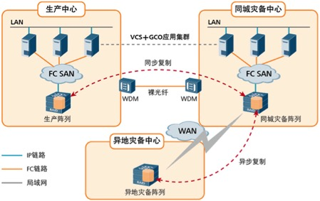

所以近一年团队对系统的维护及应对类似黑天鹅事件做了很多工作：

**从系统维护角度**，新的系统架构上，实现了数据库扩容配置化，当系统需要扩容时，把新的集群部署好，只需要简单的配置即可分担原有集群的流量，极大的降低了风险及维护成本。

**从依赖单点角度**，通过缓存和消息的互备，实现了即使数据库宕机，应用照常提供服务。核心支付的主流程依赖的服务都不能有单点，也就是说不能因为一个服务挂了就导致整个支付不可用，必须预案或者备份！

**从机房容灾角度**，实现了异地多中心，如果光纤被挖断，或者运营商网络故障，其他中心都可以分钟级去接管用户的读写流量。注意，这里说的是异地多中心，读写流量，包括写的流量，也就是每个集群的应用加数据库完全独立的存在，并且部署也不受两地三中心的距离限制。在这里数据一致性中很大的挑战会出现在流量切换的动作中，比如说A、B两个数据中心，A开始是承担20%的流量，B承担80%的流量。当把流量从一个地方切到另外一个地方的时间，有可能出现切换过程中你还在A数据中心写，但其实写完之后到B了，有可能看到出现的数据是不一致的，怎么保证在整个流量切换过程中数据是绝对一致的？这就要在很多细节处做大量的工作。

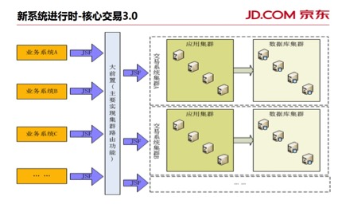

**从监控的角度**，加强业务监控和性能监控两个方向的监控深度，方法的何种性能指标，何种维度的支付成功率、转化率等等，一旦系统出现任何风吹草动，工程师和运营同学全部了然于心。

**从系统降级的维度**，深度定制配置管理系统，以及拥有自主知识产权的通道路由管理系统，研发和运营可以快速对非核心依赖的服务进行降级。

等等，做支付业务虽然有时很辛苦，但是它让参与他的小伙伴快速成长！

### 京东金融风控研发部算法工程师裴积全谈人脸识别

裴积全·京东金融风控研发部算法工程师

裴积全表示，人脸识别过程中，照片、偷录视频、人皮面具等手段不能替代真人，因有活体检测。活体检测技术，就是通过分析用户动作，人脸特征，甚至用户表情变化来确保验证用户确实是一个“活”人，而不是图片、视频或者人脸模型。”

**人脸识别技术应用于金融领域的优势**

* （1）方便、体验好。如很多人经常会出现忘记密码的现象，但生物识别技术就会很好避免这样情况，且操作起来更便捷，只需对着手机做一些小动作。

* （2）安全。如身份验证过程中，传统的密码验证不能保证操作者是其本人，人脸识别就不会出现这种问题。如手机中病毒，密码泄露等就会出现很大风险，特别是最近出现的专门套现的“羊毛党”，使得传统的验证方式面临很大的挑战，而生物识别技术则可很好的解决这些问题。

当然人脸识别技术还有一定局限性，如人脸识别技术对于双胞胎不能很准的进行验证，需要结合其他生物特征，像指纹，来甄别。如目前人脸识别技术的“迁移性”不是很理想，对于不同的应用场景需要分别进行训练优化。

**人脸识别技术应用于金融领域的特殊性**

相比于其它行业，金融领域的人脸识别技术在数据、算法和安全方面面临很多新的挑战。
首先，金融领域人脸识别技术的应用场景和一般的应用场景有很大差别，很多时候需要识别的照片是有网纹的，而这种类型的数据搜集和标注相对困难。

其次，是算法方面，金融领域的人脸训练数据非常特殊，每个人只有2、3张照片，常规人脸识别系统的训练算法不适用于这种类型的数据，必须根据数据的特点发展新的训练算法，这对人脸识别算法提出新的挑战。

最后，在金融领域人脸识别技术不仅仅要做人脸验证，还需要防范各种攻击，包括图片攻击（盗用别人图片做人脸验证），视频攻击（偷录别人的视频做人脸验证），人皮面具攻击等等，为了防范这些攻击，必须加入活体检测技术，通过分析用户的动作，人脸的特征，甚至用户的表情变化来确保验证的用户确实是一个“活”的人，而不是图片，视频或者人脸模型。

**人脸识别技术在金融领域的场景**

人脸识别的应用场景需要同时考虑技术可行性和用户的体验，目前在金融领域最佳的应用场景包括需要人工审核的实人认证业务，例如借贷业务，信息修改，以及大额交易，这些场景不仅可以为公司节约成本，还可以提高用户体验，降低交易风险。但是对于一些小额度的高频交易会对用户产生很大的打扰，可能不太适用。

### 京东金融消费金融研发部白条业务研发组，高级软件开发工程师冯成谈白条

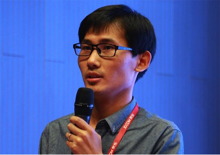
冯成·京东金融消费金融研发部白条业务研发组，高级软件开发工程师

冯成表示，白条贷后阶段，如何将部分还款表现差的用户转化为优质用户，是努力的一个方向…

白条，不仅仅简单地作为一种支付工具，而是一个消费生态体系，从而构建了白条的三大业务板块：贷前、贷中、贷后。

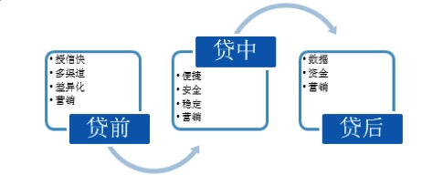

针对不同消费者人群或业务场景，并根据用户特征、风险识别和差异化定价进行精准授信。随着业务场景和用户数据特征的不断丰富，路由系统也由最初的串行优化成了并行，提高了系统响应速度，同时增加了回捞功能，对未能满足当前通道激活风险策略的用户，还进行二次的路由。

作为一个生态，当然不能缺少营销，从最初的有券到后来的无券，还款券，激活券等各种形式的优惠方式，引导用户更多的参与到白条的生态体系中。其中系统复杂度最高的也是无券营销，限制规则从最初的几个到目前的几十个，活动从最初的几个，到目前并存几百个，每一个订单的优惠券匹配，都要进行规则和活动的双重叠加匹配，从而对系统的响应速度有了更高的要求。不仅从系统结构、逻辑处理上做了优化，而且开发了数据预热中心，作为整个系统的加速器，极大的缩短了系统的响应速度，降低了数据库的负载。

白条同样也要解决数据问题，当前白条用户规模和每日产生的数据非常庞大。白条数据都是围绕用户为中心，目前通过用户Id作为切分键进行了分库分表数据存储，当需要数据库扩容时，必须进行数据迁移重新路由落库，带来很大的开发成本，所以也在通过其他的切分键进行数据存储的开发，达到可配置化的横向扩展，不需要迁移数据等额外的开发工作。由于分散的数据存储，在运营、财务、客服等方面无法满足多维度的数据查询应用，从而打造了Solr+Hbase、Mongo和ES三个数据平台。

白条经历了多个618和双十一，应对大促的挑战，很多公司的方式大多雷同，主要在于精细化。就白条而言，首先预估大促期间的流量，进行一个整体的系统压测，压测分为单场景、混合场景、读和写的压测。同时压测的数据进行隔离以及安全方便的保证，其次是做一些监控限流的措施，按系统级别、流量分布、业务血缘关系结合压测指标进行快速限流降级，某一点有问题能第一时间定位。最后就是所有依赖服务的灾备，进行全链路的梳理。大促备战检验的是系统各方面的配合，融合在一起才能达到最终的效果。

### 京东金融固收理财研发部架构师邹保威谈资产负债

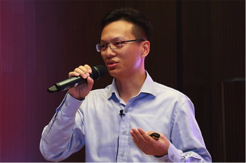
邹保威·京东金融固收理财研发部架构师

邹保威表示，资产负债和生活息息相关，看起来高大上，但每天都会在我们生活中反复实践…

最初接触资产负债管理的时候，我就在想，这有什么好管理的呢，不就是把资产信息和负债信息一个一个记录下来吗？做着做着才发现其实远不是这么简单，因为个人在生活中的资产和负债的管理虽然和机构的资产负债管理是相通的，但是它们之间的差别又是巨大的。

第一个迎面而来的棘手问题就是资产的合理分配问题，往简单说就是，如何在考虑不同金融资产期限的前提下合理分配金额，使得在流动性风险能够控制的前提下保持整体投资的最高收益，就有点像怎么用七个盖子把八个杯子尽可能的盖住的问题，而且这些盖子大小还不一样。好在数学上的线性规划给出了解决这个问题的一个思路，但是这个模型实在不好建立，因为约束条件来源于很多个已知和未知的方面，这些约束大部分都直接来源于金融的本质特性，这就迫使团队不仅要深入了解金融产品的本质，还要知道如何使用标准的会计方式来进行准确的度量。

挑战远不止于此，随着项目的进行，决定需要对资金流动性进行合理的管理，从而防止出现流动性风险，而做到这一点其实是非常困难的，迄今为止还没有完美的模型，但是有相对次优的模型，该模型要求对负债端的情况作出相对准确的预测，这个可是一个大难题，好在后期又打通了负债端的相关系统并从中获取了很多关键数据，从而能够使用一定的模型较为准确的计算出流动性，并且使用十分直观的图表进行展现，并在后期使用中对模型进行不断的回归校正，这个特性可是帮了业务很大的忙。

长远来看将要在这个系统中加入更加多的特性，例如需要考虑资产的信用风险，市场的利率风险等等，而每个特性的加入都将是对这个系统的一次提升和改造，使其成为一个较为完善的资产负债管理平台。

金融资产管理系统向来是金融机构的核心平台，但是因为它往往并不直接面向最终用户，所以通常不为人知，但是它又非常重要，京东金融固定收益类理财业务也正在构造类似的系统，用来提升资产管理水平以及效率，并致力于将其打造成一个支持京东金融各种金融理财产品业务的特有行业系统，并使之符合行业监管要求。它的主要功能是管理负债端面向最终用户理财产品的发行以及其销售情况，在资产端管理资产的生命周期以及最优组合，能够在最大程度上优化投资负债行为，从而扩大业务盈利。并打通内部外部系统间交互，提升业务管理水平以及效率。这个系统定位为固收理财业务的投资管理分析决策系统，以该业务下的资产、负债、投资信息管理为出发点，通过对各类资金轨迹的记录，资产价值的估算，未来几日资产到期和用户赎回情况的实时监控和分析，及时反应出账户下的资金水位，计算账户当前价值，为决策者提供准确的投资数据和投资方案，在为用户提供平滑、简洁、直观的使用体验前提下，最终实现有效降低流动性兑付风险和运营成本的最小化以及投资利润最大化的目标。

**写在最后**

以上所述仅是京东金融技术的部分内容，其中有些取自「京东TALK：专注技术·自我迭代——金融技术交流系列分享活动」。当下，金融领域错综复杂，京东金融从「自营金融业务」逐步兼顾「为金融行业服务」的做法足以证明，其是一个领先的金融科技公司。相信在未来，金融科技公司会驱动金融领域发生很大的变革和进步，也会为传统金融业赋能，提升或改进行业中历史留存的成本、效率等问题。

> 作者：王雪燕 来源：51CTO|2017-02-15 19:04 来源: [http://www.51cto.com/art/201702/531343.htm](http://www.51cto.com/art/201702/531343.htm)*

